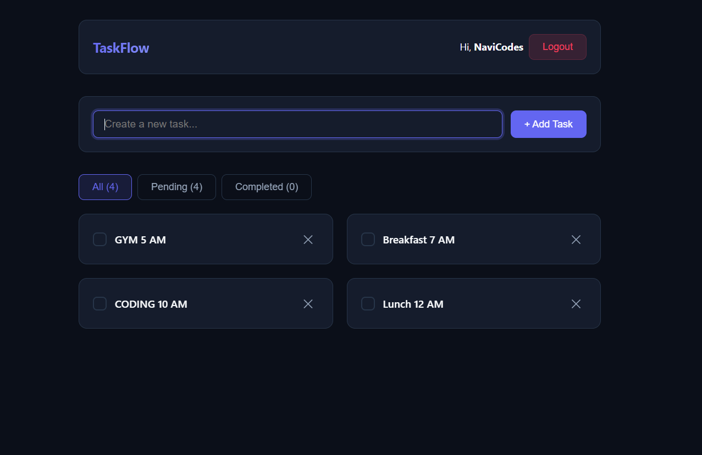

# ⚡ TaskFlow — Modern React Task Manager

TaskFlow is a sleek, responsive task management application built with **React**, leveraging modern React Hooks (`useState`, `useEffect`, `useContext`) for global state management, user authentication simulation, and persistent local storage.



---

## ✨ Features

- **🔐 Simulated Authentication:** Global user session management using `AuthContext`.
- **⚡ Centralized State Management:** React Context API (`TaskContext`) avoids prop drilling across components.
- **💾 Local Storage Syncing:** `useEffect` side-effects synchronize tasks and session data directly to browser storage.
- **🔍 Active Task Filtering:** Filter view between All, Pending, and Completed tasks seamlessly.
- **🎨 Modern Responsive UI:** A glassmorphic design system written completely in pure CSS using custom design tokens (`index.css`).
- **🌙 Automatic Dark Mode:** Built-in CSS media query support matching user system preferences.

---

## 🛠️ Built With

* [React.js](https://react.dev/) — Frontend Library
* [Vite](https://vitejs.dev/) / [Create React App](https://create-react-app.dev/) — Build Tooling
* [CSS Custom Properties](https://developer.mozilla.org/en-US/docs/Web/CSS/--*) — Design System & Tokens

---

## 📁 Project Structure

```text
src/
├── components/
│   ├── Navbar.jsx       # Auth display and login/logout controls
│   ├── TaskForm.jsx     # Input form for creating new tasks
│   └── TaskList.jsx     # Responsive grid displaying filtered task cards
├── context/
│   ├── AuthContext.jsx  # Global state for user session management
│   └── TaskContext.jsx  # Global state for task operations and LocalStorage sync
├── App.jsx              # Main container wrapping Context Providers
├── index.css            # Single-file global design system & component styles
└── main.jsx             # React DOM entry point